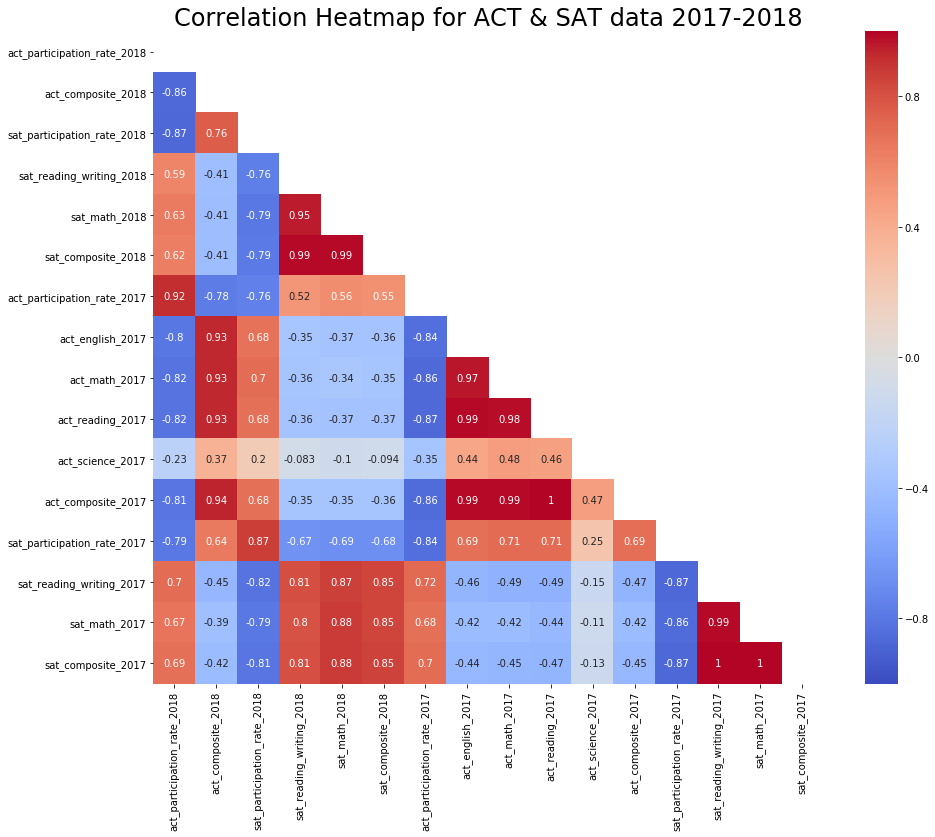
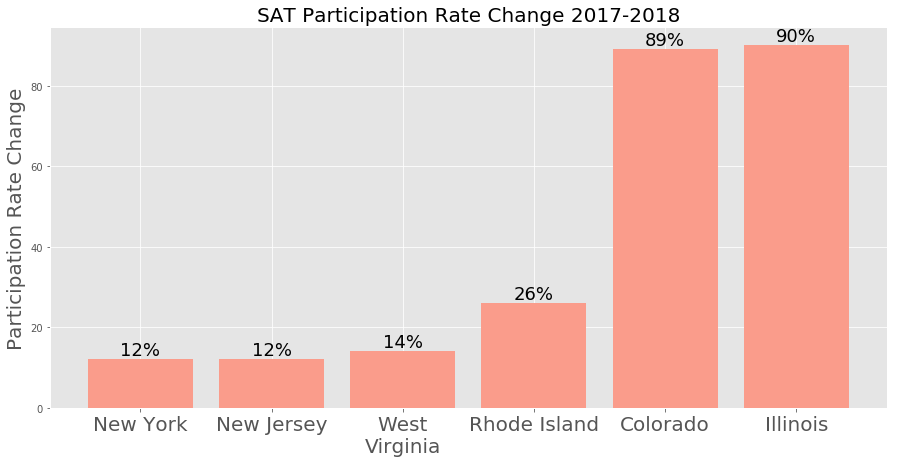
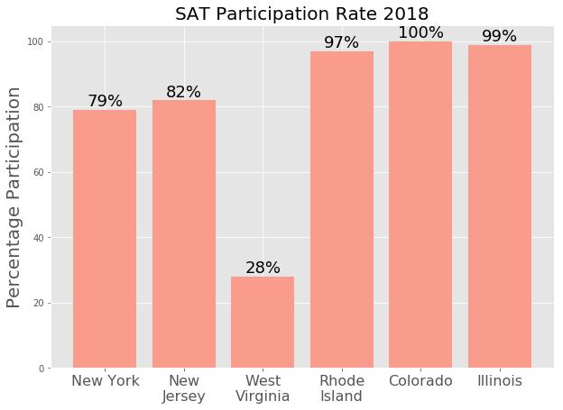

# SAT Which State Next?

_Justin August_

## Problem statement

- Choose new states to focus on increasing participation in the SAT
- Identify 3 potential states for investigation
- Decide on 1 target state for expansion

## Description of Data
    
- [2017 SAT Scores](./data/sat_2017.csv) ([source](https://blog.collegevine.com/here-are-the-average-sat-scores-by-state/))
- [2017 ACT Scores](./data/act_2017.csv) ([source](https://blog.prepscholar.com/act-scores-by-state-averages-highs-and-lows))

	>These data give average SAT and ACT scores by state, as well as participation rates, for the graduating class of 2017.

- [2018 SAT Scores](./data/sat_2018.csv) ([source](https://reports.collegeboard.org/sat-suite-program-results/state-results))
- [2018 ACT Scores](./data/act_2018.csv) ([source](http://www.act.org/content/dam/act/unsecured/documents/cccr2018/Average-Scores-by-State.pdf))

| Feature                       | Type   | Dataset    | Description                                                                 |
|-------------------------------|--------|------------|-----------------------------------------------------------------------------|
| state                         | object | both       | The name of the state that the data refers to                               |
| act_participation_rate_2017   | float  | ACT 2017   | The percentage rate of participation                                        |
| act_english_2017              | float  | ACT 2017   | The average score for the English subtest in 2017                           |
| act_math_2017                 | float  | ACT 2017   | The average score for the Math subtest in 2017                              |
| act_science_2017              | float  | ACT 2017   | The average score for the Science subtest in 2017                           |
| act_reading_2017              | float  | ACT 2017   | The average score for the Reading subtest in 2017                           |
| act_composite_2017            | float  | ACT 2017   | The average composite ACT score in 2017                                     |
| act_participation_rate_2018   | float  | ACT 2018   | The percentage rate of participation                                        |
| act_composite_2018            | float  | ACT 2018   | The average composite ACT score in 2017                                     |
| sat_participation_rate_2017   | float  | SAT 2017   | The percentage rate of participation                                        |
| sat_reading_writing_2017      | float  | SAT 2017   | The average score on the Evidence Based Reading and Writing subtest in 2017 |
| sat_math_2017                 | float  | SAT 2017   | The average score on the Math subtest in 2017                               |
| sat_composite_2017            | float  | SAT 2017   | The average composite score on the SAT in  2017                             |
| sat_participation_rate_2018   | float  | SAT 2018   | The percentage rate of participation                                        |
| sat_reading_writing_2018      | float  | SAT 2018   | The average score on the Evidence Based Reading and Writing subtest in 2018 |
| sat_math_2018                 | float  | SAT 2018   | The average score on the Math subtest in 2018                               |
| sat_composite_2018            | float  | SAT 2018   | The average composite score on the SAT in  2018                             |
| sat_participation_rate_change | float  | Calculated | Calculated change in participation rates between 2017 and 2018              |
| act_participation_rate_change | float  | Calculated | Calculated change in participation rates between 2017 and 2018              |

## Key takeaways:
- Ubiquity across states is a marketing point in terms of comparison
- On the ground realities and legal issues play into moving towards full participation
- There are clear regional differences in the country
- Students and parents in New Jersey are in need of a qualifying test for High School graduation
- New Jersey is the 11th largest state - small percentages gains here are large total gains

## Next Steps & Additional Data Analysis
- Existing customer demographic information
- Graduation requirements per state
- Socioeconomic information of SAT test takers
- Destinations for test-takers & list of colleges that accept/don't accept SAT
-  Marketing push based on this information

## Media Links
[Presentation Here](https://docs.google.com/presentation/d/1VXePQ2neN2fO8sqE3214WL8E1D6flrOuWw4Zy6ZILgk/edit?usp=sharing)